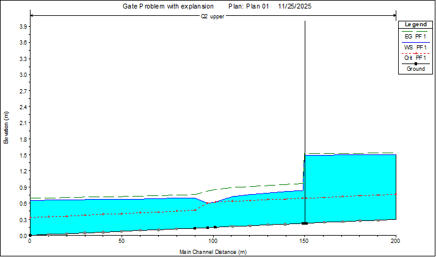
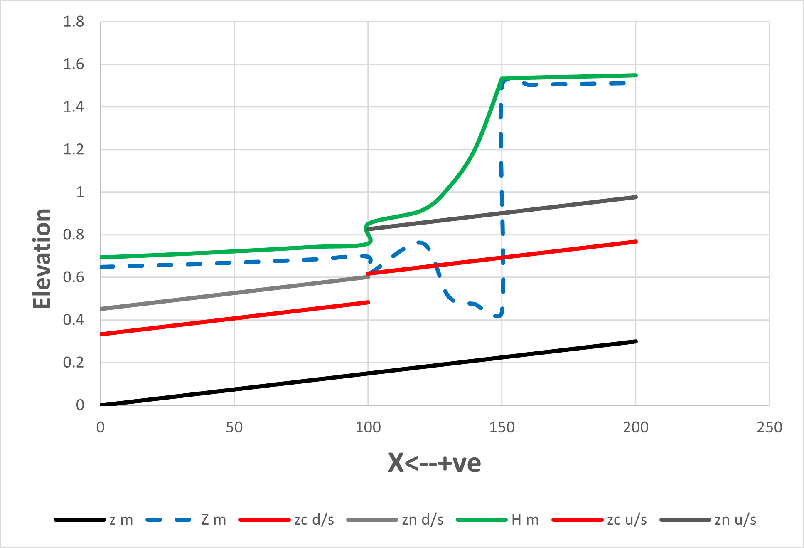
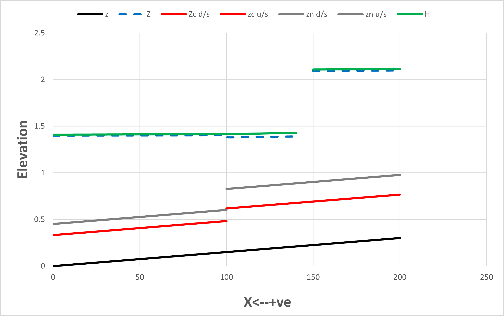

# open-channel-gate-flow-hec-ras
  
## Project Overview

This project analyzes flow through a sluice gate in a rectangular open channel with a sudden expansion. Water surface profiles were computed using manual spreadsheet calculations and verified using HEC RAS. Two downstream boundary condition cases were evaluated to study different flow regimes.

## Problem Description

The system consists of a rectangular channel with a sluice gate dividing the upstream reach and connecting to a wider downstream channel. Channel geometry, Manning’s roughness, slopes, gate opening, and discharge are specified. The objective is to determine water surface profiles and flow regimes for the given configurations.

## Case Definitions

### Case 1

Downstream flow depth is observed to be 0.65 m. This case evaluates gate controlled flow, the potential for a hydraulic jump, and the transition from supercritical to subcritical flow.

### Case 2

Downstream flow depth is observed to be 1.4 m. This case evaluates drowned flow conditions and the absence of a hydraulic jump.

## Analytical and Spreadsheet Solution

Detailed calculations were performed using Excel. Computations include velocity, specific energy, Froude number, gradually varied flow profiles, and hydraulic jump conditions. These calculations are included in the `Excel_Calculations` folder.

## HEC RAS Modeling

The problem was modeled in HEC RAS using steady flow analysis. Simulations were conducted with and without ineffective flow areas to represent sudden expansion effects. The flow optimization tool was used to split discharge where applicable.

## Results and Profiles

### Case 1 Results

Observed results show transitions between supercritical and subcritical flow, with a hydraulic jump occurring downstream of the gate. Water surface profiles reflect the expected regime changes.

### Case 2 Results

Results indicate drowned flow conditions with no hydraulic jump present. The water surface profile remains subcritical throughout the downstream reach.

## Comparison and Discussion

Analytical results were compared with HEC RAS outputs. The inclusion of ineffective flow areas in the model affected computed profiles, particularly near the expansion. Agreement between spreadsheet and numerical solutions was generally strong, validating the analytical approach.

## Tools and Software

- Excel for manual calculations
- HEC RAS for numerical modeling

## Repository Contents

- `Pictures`: Profile plots and HEC RAS output images
- `Excel_Calculations`: Detailed engineering computations
- HEC RAS files: Model setups for both cases
- `hw7.pdf`: Original problem statement

## Key Skills Demonstrated

- Open channel hydraulics
- Gate flow analysis
- Hydraulic jump identification
- Spreadsheet based engineering calculations
- HEC RAS modeling and interpretation
